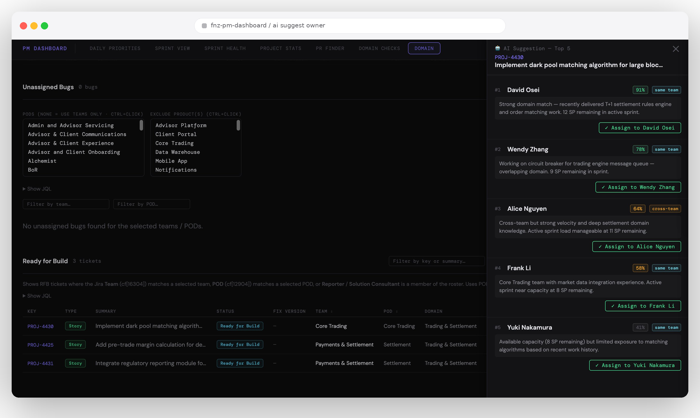
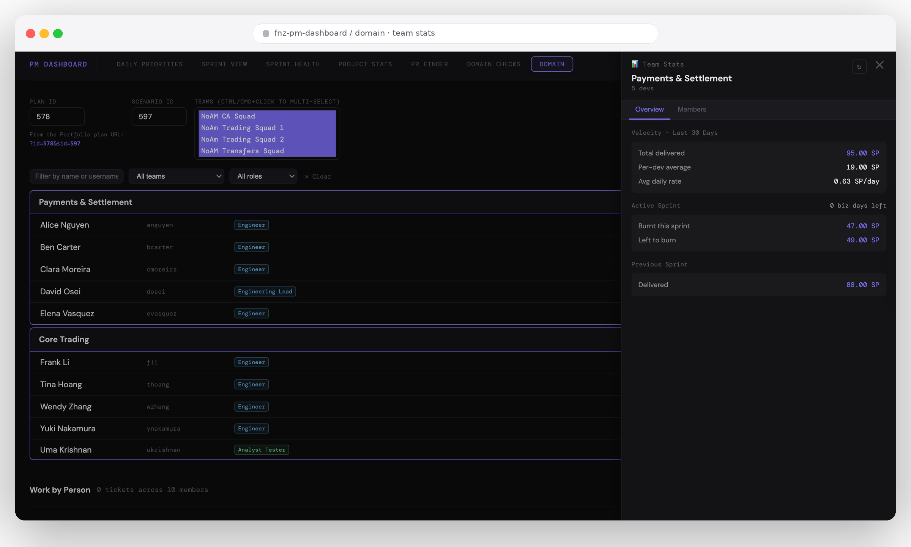
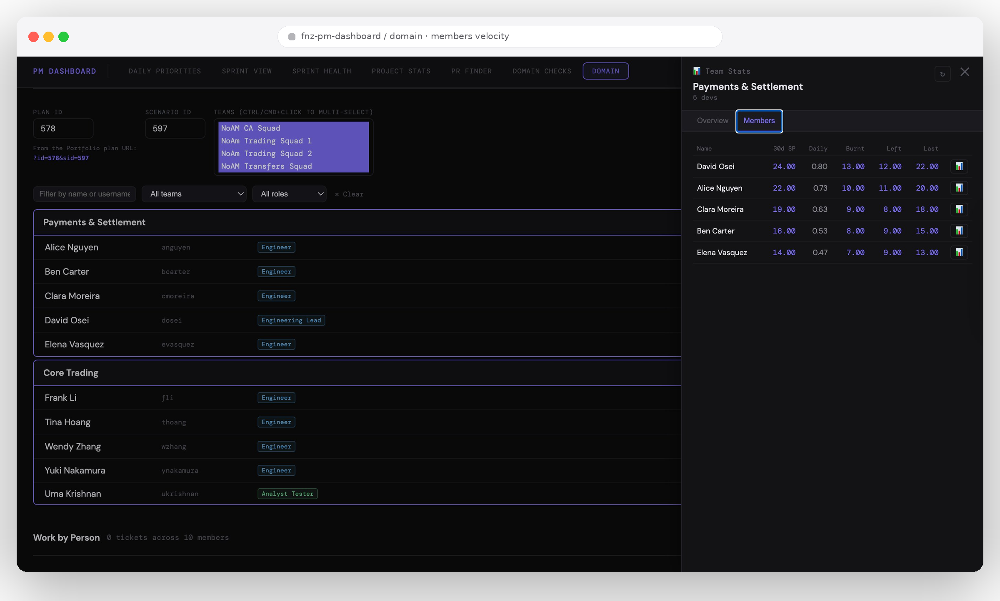
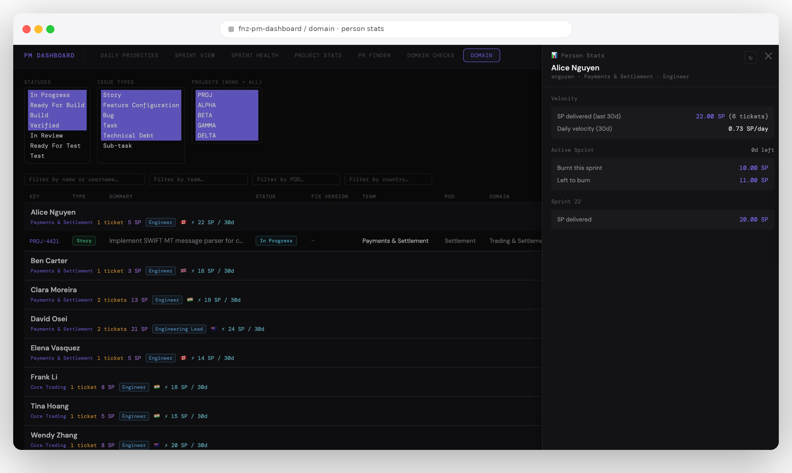

# PM Dashboard

A local single-page dashboard for technical project managers working with Jira, GitHub, and Azure DevOps. Built to replace a stack of saved JQL queries, half a dozen open Jira tabs, and the daily ritual of context-switching between domains, sprints, and people.

---

## Highlights

### 🤖 AI Suggest Owner — ranked candidates with reasoning
Surfaces the top 5 assignment candidates per ticket with confidence scores, team-fit signals, and one-click write-back to Jira. Powered by GPT-4o (via GitHub Models) over Jira ticket metadata + live sprint state — domain match, current SP load, and recent delivery history.



### 🌐 Domain View — team velocity at a glance
Sprint health and velocity rolled up by JPO portfolio domain, with live filtering by team, role, POD, and country. The right-hand stats panel slides open per team or per person without losing the list context.

<table>
  <tr>
    <td width="50%"></td>
    <td width="50%"></td>
  </tr>
  <tr>
    <td><em>Team Stats — Overview tab.</em> 30-day delivered SP, per-dev average, daily rate, active and previous sprint burn.</td>
    <td><em>Team Stats — Members tab.</em> Per-developer velocity with inline links straight into Jira.</td>
  </tr>
</table>

### 👤 Person Stats — drill down to individual contribution
Click any team member to see their tickets, fix versions, sprint burn, and 30-day velocity. Filter by status, issue type, and project to isolate exactly the work in scope.



---

## What's in the repo

| File | Purpose |
|---|---|
| `dashboard.html` | Single-page app — all views and widgets |
| `proxy.py` | Local Python proxy — forwards requests to Jira and GitHub Models |
| `config.json` | Instance configuration — field IDs, workflow statuses, issue types, branding |
| `roles.example.json` | Sample person directory. Copy to `roles.json` and fill in with your real roster. |
| `boards.json` | Jira board IDs used for sprint queries |

---

## Quick start

### 1 — Prerequisites
- Python 3.x ([python.org/downloads](https://www.python.org/downloads/))
- Jira Personal Access Token (PAT) — your Jira instance → Profile → Personal Access Tokens
- *(Optional)* GitHub PAT for AI owner suggestions — see [AI suggest owner](#-ai-suggest-owner)

### 2 — Run the proxy
Open a terminal in this folder and run:
```
python proxy.py
```
```
====================================================
  PM Dashboard — Local Proxy
====================================================
  Open: http://localhost:8765/
  Keep this window open while using the app.
  Ctrl+C to stop.
====================================================
```

### 3 — Open the app
Navigate to **http://localhost:8765/** in your browser.

### 4 — Configure
Fill in the config bar at the top:

| Field | Example | Notes |
|---|---|---|
| Jira base URL | `https://your-jira.example.com/jira` | Overrides placeholder from `config.json` |
| Bearer token | Your Jira PAT | Hidden by default — click **show** |
| GitHub token | `ghp_…` | Optional — enables 🤖 AI suggest and PR Finder |
| ADO token | Azure DevOps PAT | Optional — enables PR Finder for ADO repos |
| Project | `PROJ` | Hidden on Domain tab |
| POD(s) | `Core Trading` | Hidden on Domain tab — list populated from `config.json` |

---

## Views

### Daily Priorities · Sprint View · Sprint Health · Project Stats
Standard PM views — see in-app widgets.

### PR Finder
Search GitHub and Azure DevOps for PRs matching a Jira ticket key. See [PR Finder](#pr-finder) below.

### Domain tab — primary active view

Four widgets driven from the JPO Portfolio API + Jira:

| Widget | What it shows |
|---|---|
| **D1 — Team Roster** | JPO portfolio teams with all members, roles, and country flags |
| **D2 — Work by Person** | All active tickets grouped by dev owner, with SP load and velocity |
| **D3 — Unassigned Bugs** | Open bugs with no dev owner assigned |
| **D4 — Ready for Build** | RFB tickets awaiting assignment or sprint |

#### D1 — Team Roster
*See [Domain View screenshots](#-domain-view--team-velocity-at-a-glance) above.*

- Expandable team blocks listing every member
- Each row shows: display name · Jira username · role title · country flag
- Role and country data sourced from `roles.json`
- **📊 Team Stats** button per team — opens a stats panel with:
  - *Overview tab*: 30d SP delivered, per-dev average, daily rate, active sprint Burnt/Left to burn (linked to Jira), previous sprint delivered
  - *Members tab*: per-developer breakdown with inline Jira links on all SP values

#### D2 — Work by Person
*See [Person Stats screenshot](#-person-stats--drill-down-to-individual-contribution) above.*

- **Dev rows** appear first (Engineers, Tech Leads), sorted A→Z
- **Non-dev rows** appear below at reduced opacity with an italic label
- Each person header shows:
  - Ticket count chip (amber when > 0)
  - **SP load** chip (purple) — sum of story points on in-flight tickets
  - **✓ N done** chip (green) — SP completed in open sprint (Ready for Release), loaded async
  - Role badge (colour-coded by role type)
  - Country flag emoji
- Ticket rows hidden by default; click header to expand
- Column headers only visible when at least one person is expanded
- Filter bar: name/username · team/squad · POD · country
- Inline edit: Dev Due date (calendar picker, auto-saves on date select) · Sprint · Team · Dev Owner
- Changing Dev Owner auto-sets Jira Assignee field and moves the ticket row to the new owner's block

#### D3 — Unassigned Bugs
- Sortable by severity, team, POD, sprint, dev owner, dev due
- Filter bar: team · POD
- Inline edit: Dev Due · Sprint · Dev Owner
- **🤖 Suggest Owner** button per row — see [AI suggest owner](#-ai-suggest-owner)

#### D4 — Ready for Build
*See [AI Suggest Owner screenshot](#-ai-suggest-owner--ranked-candidates-with-reasoning) above.*

- Sortable by team, POD, sprint, dev owner, dev due, dependency
- Filter bar: key/summary · team · POD
- Inline edit: Dev Due · Sprint · Team · Dev Owner
- **🤖 Suggest Owner** button per row — see [AI suggest owner](#-ai-suggest-owner)

---

## PR Finder

Type a Jira key (e.g. `PROJ-12345`) and press **Enter** or **Search**. The proxy fans out to all configured GitHub and ADO repositories in parallel and returns every PR whose title contains the exact key.

**Results table columns:**

| Column | Notes |
|---|---|
| Repo | Source label (`GH` / `ADO`) + repo name from `config.json` |
| PR | Linked PR number |
| Title | Full PR title |
| Status | `open` · `draft` · `merged` · `closed` · `abandoned` |
| Age | Days since creation; amber ≥ 4d, red ≥ 8d. Merged PRs show date/time merged beneath |
| Comments | GitHub comment count (ADO comment count not available from list endpoint) |
| Author | PR author display name |

**Setup:**
1. Add your GitHub PAT (with `repo` read scope) to the **GitHub token** field in the config bar
2. Add an Azure DevOps PAT (with **Code → Read** scope) to the **ADO token** field
3. Configure repos in `config.json` under `prSources` — see [config.json](#configjson--instance-configuration)

Both tokens are stored in `sessionStorage` and cleared on tab close.

---

## 🤖 AI suggest owner

Clicking **🤖** on any D3 or D4 ticket sends a request to GitHub Models (`gpt-4o`) via the local proxy. The panel that opens — pictured at the top of this README — ranks the top 5 candidates with confidence scores and short, citable reasoning.

**Payload sent to the model:**
- Ticket key, summary, type, domain, team, POD
- Full dev roster (name, username, squad, role, current ticket count, current SP load)

**Response rendered inline:**
- Green chip: `🤖 Name 87%` — hover to see reasoning
- Amber chip if confidence < 60%
- **Accept** button — writes `Dev Owner` + `Assignee` back to Jira in one click

**Setup:**
1. Go to [github.com/settings/tokens](https://github.com/settings/tokens) and generate a classic PAT (no specific scopes required)
2. Ensure your GitHub account has access to [github.com/marketplace/models](https://github.com/marketplace/models)
3. Paste the token into the **GitHub token** field in the config bar

---

## roles.json

Local file that enriches the roster with role titles and countries. Not committed to git.

Format:
```json
[
  { "name": "Display Name", "country": "New Zealand", "role": "Engineer" }
]
```

- Matched case-insensitively by display name
- Served by the proxy at `GET /api/roles`
- Changes take effect on next page refresh (no proxy restart needed)

---

## Proxy routes

| Method | Path | Purpose |
|---|---|---|
| `GET` | `/` | Serves `dashboard.html` with `window.JIRA_CFG` injected from `config.json` |
| `GET` | `/api/config` | Returns `config.json` as JSON |
| `GET` | `/api/roles` | Serves `roles.json` |
| `GET` | `/api/boards` | Serves `boards.json` |
| `POST` | `/api/jira` | Jira JQL search |
| `POST` | `/api/jira/update` | Jira field write (PUT via POST) |
| `POST` | `/api/jira/sprints` | List sprints for a board |
| `POST` | `/api/jira/sprint/assign` | Move issue to sprint or backlog |
| `POST` | `/api/jira/jpo-teams` | JPO portfolio team members |
| `POST` | `/api/velocity` | 30-day resolved SP per dev |
| `POST` | `/api/active-sprints` | Active sprint dates across board IDs |
| `POST` | `/api/last-sprint` | Most recently closed sprint per board |
| `POST` | `/api/sprint-burn` | SP resolved in a sprint per dev (date-scoped) |
| `POST` | `/api/sprint-committed` | SP remaining (unresolved, active statuses) per dev |
| `POST` | `/api/suggest-owner` | AI dev-owner suggestion via GitHub Models |
| `POST` | `/api/pr-search` | Search GitHub + ADO for PRs by Jira key (parallel fan-out) |

---

## config.json — instance configuration

All instance-specific values are isolated in `config.json`. Edit this file to adapt the dashboard to your Jira instance — no code changes required.

```jsonc
{
  "branding": {
    "title": "My PM Dashboard",           // page title + header
    "jiraBasePlaceholder": "https://..."   // placeholder in config bar
  },
  "fields": {
    "storyPoints":        "customfield_",
    "sprint":             "customfield_",
    "devOwner":           "customfield_",
    // ... see full list in config.json
  },
  "issueTypes": {
    "story": ["Story", "Feature Configuration", "Task"],
    "bug":   ["Bug"]
  },
  "workflow": {
    "activeDevStatuses":   ["Analysis", "Ready for Build", ...],
    "leftToBurnStatuses":  ["Ready for Build", "Verified", ...],
    "velocityResolutions": ["Done", "Fixed"]
  },
  "dependencyLinks": {
    "custom": ["has dependant", "has to be done before"]
    // "blocks" is a Jira built-in and does not need to be listed
  },
  "pods":     [...],   // populates the POD filter dropdown
  "products": [...],   // populates the Exclude Product dropdown
  "prSources": {
    "github": [
      { "label": "MyRepo", "owner": "MyOrg", "repo": "my-repo" }
    ],
    "ado": [
      { "label": "MyRepo", "org": "MyOrg", "project": "MyProject", "repo": "my-repo" }
    ]
  }
}
```

The proxy injects `config.json` as `window.JIRA_CFG` into the served HTML so all JS constants (`F_SP`, `F_DEV_OWNER`, `STORY_TYPES`, etc.) are derived from it at runtime. Hardcoded fallback defaults are retained for direct file-open without the proxy.

---

## Jira custom field map

| Field | Custom field ID | `config.json` key |
|---|---|---|
| Story Points | `customfield_` | `fields.storyPoints` |
| Sprint | `customfield_` | `fields.sprint` |
| POD | `customfield_` | `fields.pod` |
| Dev Owner | `customfield_` | `fields.devOwner` |
| Analyst Due Date | `customfield_` | `fields.analystDue` |
| Developer Due Date | `customfield_` | `fields.devDue` |
| Team | `customfield_` | `fields.team` |
| Severity | `customfield_` | `fields.severity` |
| Solution Consultant | `customfield_` | `fields.solutionConsultant` |
| Product | `customfield_` | `fields.product` |
| Domain | `customfield_` | `fields.domain` |
| Total Linked Cases | `customfield_` | `fields.linkedCases` |
| Epic Link | `customfield_` | `fields.epicLink` |

---

## Security notes
- Bearer token stored in browser memory only — cleared on tab close
- Proxy binds to `localhost` only — not reachable from other machines
- Proxy rejects non-`https://` Jira base URLs
- GitHub token is sent only to `models.inference.ai.azure.com` (AI suggest) and `api.github.com` (PR Finder) — never to Jira
- ADO token is sent only to `dev.azure.com` — never to Jira or GitHub
